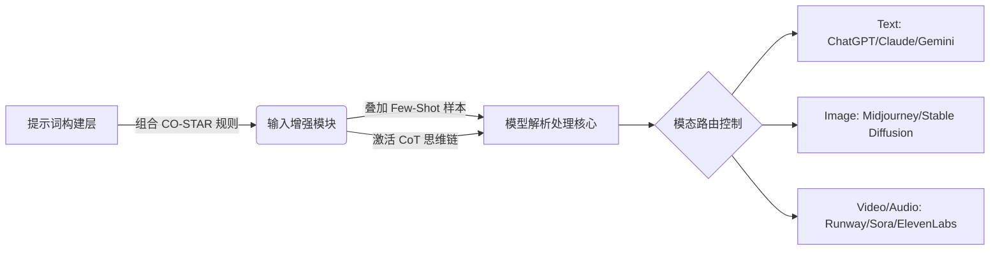
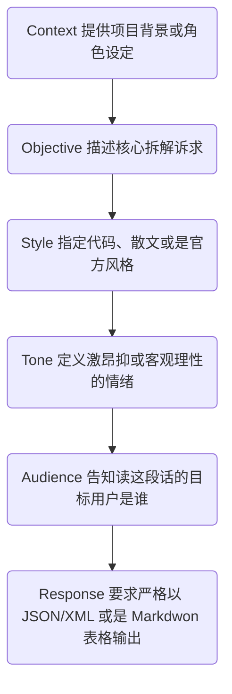

# AI工具精通与提示词工程实战指南

> 提示词不仅是沟通的文字，更是一门将逻辑思维工程化解构的协议；掌握工具生态，即拥有了效率跃迁的底层杠杆。

# 一、背景
在了解了底层原理之后，我们发现即使模型足够强大，低质量的内容获取方式（比如随意的自然语言闲聊）也必然由于缺乏明确指示而导致答案跑偏或幻觉频发。建立本体系旨在形成规范的提示词（Prompt）投喂流程，并系统整理各领域最前沿的 SaaS 工具矩阵，指导团队从沟通转变成“精确指令集编程”。 

# 二、整体架构
提示词与全栈工具的应用架构可以拆分为三个层级：输入增强结构、大模型理解层与任务路由平台分发。
下图展示了高质量业务内容是如何从想法转变为最终数字资产的完整通路结构：


架构说明：要想突破普通用户的局限，开发者必须具备掌控左侧“输入增强模块”中各种高级结构化设计与参数管理的能力，从而保证右侧输出的确定性。

# 三、核心模块详解：结构化提示词设计
## 3.1 CO-STAR 提示框架
普通的提示词“帮我写个报告”太过简陋。CO-STAR 代表六个必须填写的维护节点： Context(上下文)、Objective(目标)、Style(风格)、Tone(语调)、Audience(受众目标)与 Response(回复格式)。在流水线中处理如下：


其中，最具工程价值的关键节点是 **Response 环节**。因为它直接约束了大模型返回的内容格式，保障与上层应用系统可以无缝利用代码进行字段解析与截取，规避脏数据污染。

# 四、核心模块详解：高阶设计模式
当遇到业务非常复杂（比如架构评估、代码多语言高频翻译、复杂推演）时，应引入以下两项重要的架构外挂设计模式。

## 4.1 少样本上下文注入 (Few-Shot Prompting)
与传统的零样本测试不同，在构建Prompt时，显式植入两三个非常高质量的“业务场景->预期代码或表现”映射案例。此模式极大地压缩了模型的理解损耗，类似于开发中的前置环境初始化与预期结果定义。

> **🔍 Q&A 实测复盘：用 Few-Shot 平替 Flutter Pigeon**
> 当我们聊到如何自动编写繁杂的 Flutter MethodChannel 通信层时，抛出了一个挑战：不想写长篇大论解释原理，怎么让 AI 秒懂代码结构？
> **破局与解答：** 直接扔给它两套正确的 Input/Output 示范记录。例如：`Input: openUrl(String url);` -> `Output: "openUrl" -> { ... call.argument... }`。
> 仅仅两组案例，就像给了它单元测试用例一样。AI 瞬间抓住了我们的格式规约，零废话直接输出带保护逻辑的胶水层代码！

## 4.2 思维链路由控制 (Chain of Thought - CoT)
当运算推理极高时，提示词内增加诸如“请先列出计算公式和逻辑链条，再一步一步推导输出” (Let's think step by step)。这强迫模型底座释放了中间每步推演所对应的隐含注意力权重计算空间，让逻辑断层不复存在。

> **🔍 Q&A 思维考题：直接提问为何永远查不出 Flutter 滑动卡顿？**
> 你是否遇到过：问 AI “为什么列表滑动卡？”，它永远像客服一样回复“建议别用大图或优化 setState()”？
> **破局与解答：** 必须使用思维链！当你要求它：“**请你 Step-by-Step 推理：1.GPU渲染树 2.Skia光栅化开销 3.IO解码机制**”时。被逼深挖底层步骤后，它的回答直接飙升到架构师级别，精准命中 `saveLayer` 叠加大量圆角造成的灾难级开销。

# 五、实战用例
我们在实际推进项目中完成了若干个典型高质量AI应用案例，以下为你还原咱们讨论过的排障思维。

> **🎯 图像生成的终极翻车大考：手画成了鸡爪怎么拯救？**
> 我们探讨过这个无解难题：好不容易一张美脸，但手崩了。如果选择全图重绘，整张脸的灵气全毁。怎么破？
> **唯一必杀技：局部重绘 (Inpainting)。** 在主画板里框选手部变异区域。只输入手部的补丁提示词。“别动脸，手部出Bug只修手”。配合这招，如果还要硬借他人的形体骨架，就必须要熟练掌握咱们之前聊的 **【换头术】：底层定肢体 + `--cref` 锁脸系数调弱至 `--cw 50`**。

**Midjourney 端** - 跨引擎连续创作一致性保证
```text
/imagine prompt: A young female professional programmer working on a clean desk, dual monitors, focus on screen ui, digital illustration style, highly detailed --cref https://image-url-of-our-base-character.jpg --cw 100 --ar 16:9
```
* **场景说明**：在处理业务的宣传配图或者文档配图时，通过添加 `--cref <url>` 这一角色参考参数，以及 `--cw 100`（锁定容貌加服装环境权重），完成了相同角色在不同物理场景间的高度穿越连续性展现。

# 六、总结
本阶段学习沉淀了应用大模型时的外围辅助技能与优质工具栈方案，形成如下矩阵对比参考库：

| 应用场景 / 模块 | 首选头部平台 / API | 核心优势说明与应用指北 |
|---|---|---|
| 深度代码与架构辅导 | Claude 3.5 Sonnet / GPT-4o / Cursor | Claude具备业内最强的代码逻辑联结能力；Cursor 是基于此能力的集成最佳载体。 |
| 多模长文本挖掘归纳 | Gemini 1.5 Pro | 傲视群雄的长窗记忆(超百万Tokens)，适合直接投喂几十个PDF或是库表直接提炼设计图。 |
| 高保真商业级图文生成 | Midjourney V6 / Flux 1 / SD | MJ更适合创意发散无门槛直出；涉及复杂的电商实物换装、骨架控制则必须引入SD/Webui流派。 |
| 音视频AIGC矩阵 | Runway Gen-3 / Luma / ElevenLabs | 音频转译和克隆推荐ElevenLabs；物理特效演示可利用Gen-3的图生视频能力。 |

**注意事项清单：**
* 使用提示词框架获取程序参数提取时，务必利用分割符号（如 `'''`， `###`，或 XML 标签 `<instruction>`）保护业务逻辑指令不受用户自行注入数据的破坏从而产生 Prompt Injection（提示词注入攻击）安全隐患。
* 对待复杂的需求迭代，切忌在一个对话上下文中完成，应严格按照拆分组件化的思路使用多阶段代理来处理大吞吐量和长链路目标。
