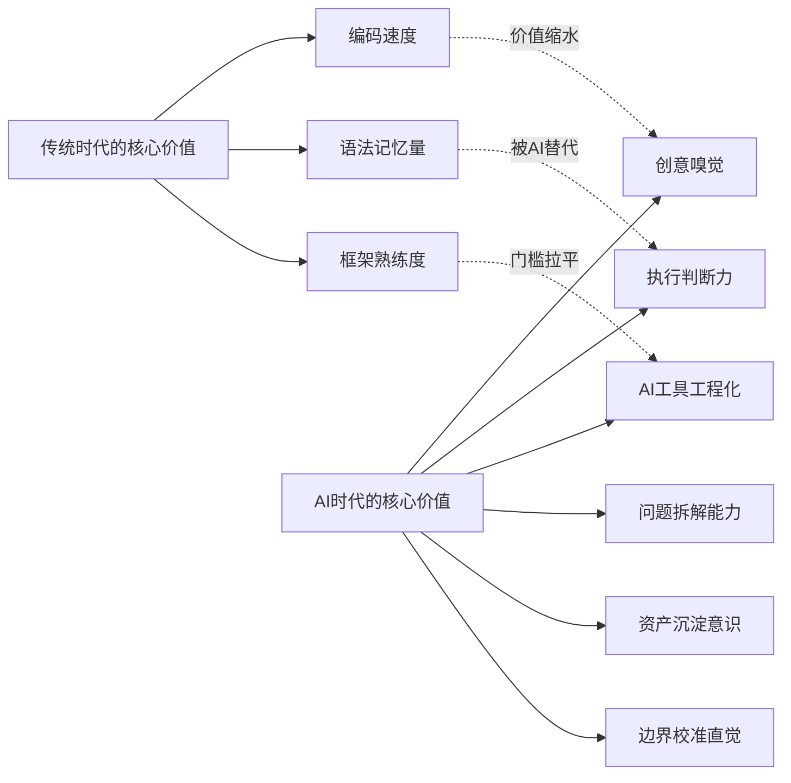
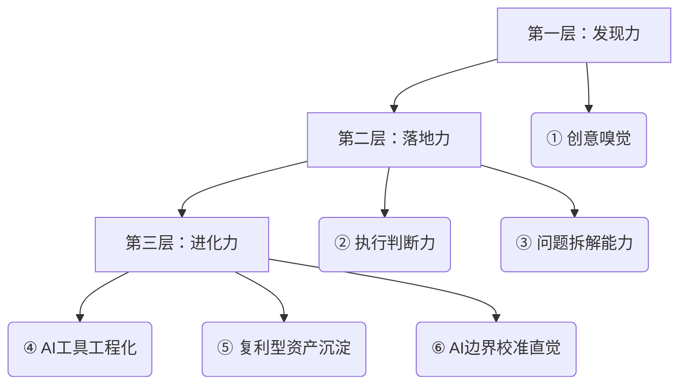
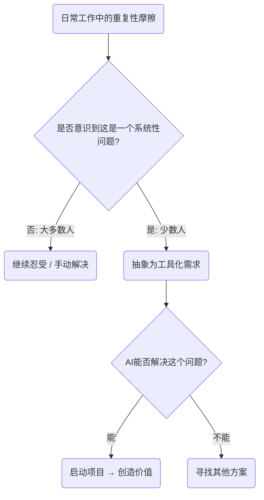
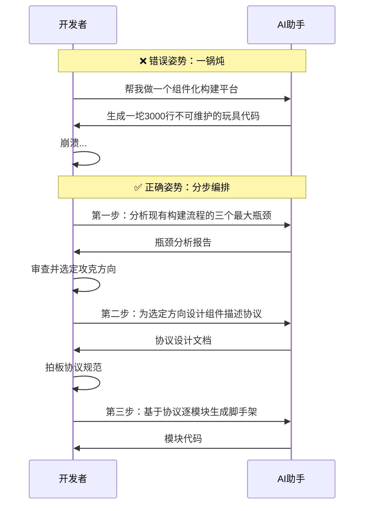
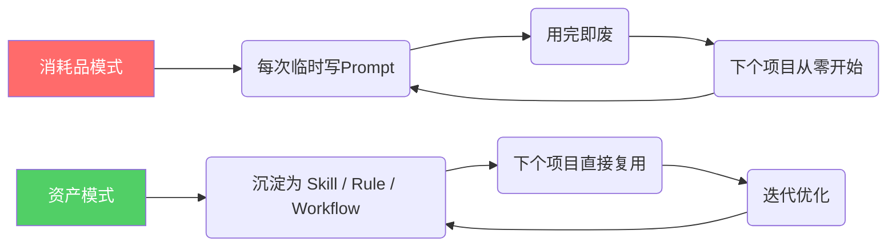
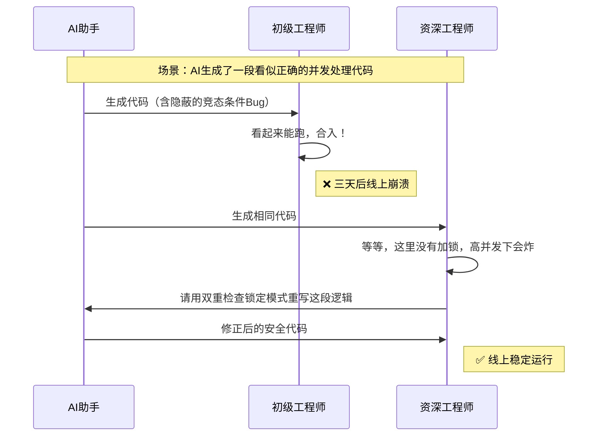
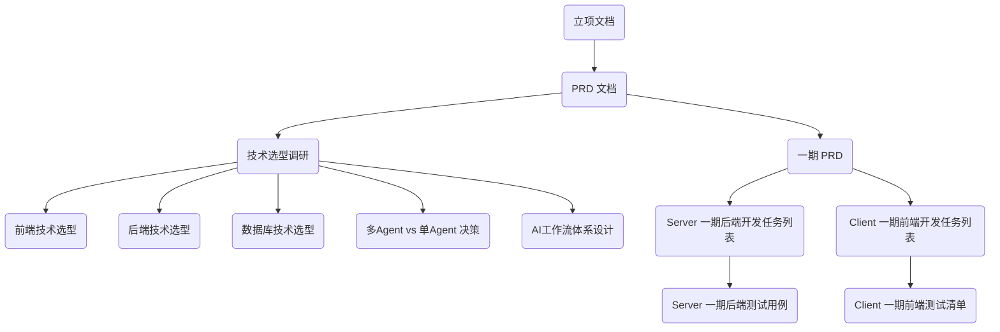

# AI时代不被淘汰的六项核心能力

> AI把"怎么做"的门槛拉平了，但"做什么"和"做得对不对"的差距反而被放大了。本文基于真实项目实战复盘，提炼出在AI时代持续保持竞争力的六项核心能力模型。

# 一、背景：技术平权之后，真正的战场在哪里

2025年至今，AI工具以令人窒息的速度迭代。从最初的提示词裸聊，到如今的Rules、Skill、Workflows、多Agent编排，开发效率已经发生了质变。

但一个残酷的现实正在浮现：**AI把所有人的技术执行力拉到了同一条起跑线上。** 以前一个资深工程师和一个初级工程师的代码产出差距可能是3~5倍，现在借助AI，这个差距被压缩到了1.5倍以内。

下图展示了AI时代能力价值的迁移方向：


上图的核心信息是：左侧传统时代的三项硬本事（编码速度、语法记忆、框架熟练度）正在被AI快速拉平甚至替代，而右侧六项"软硬结合"的能力成为了真正的护城河。

那么，到底哪些能力决定了你在这场变革中是"被加速"还是"被淘汰"？以下是我在多个真实项目实战中提炼出的六项核心能力模型。

# 二、整体架构：六项能力的分层模型

这六项能力并非孤立存在，而是构成了一个从"发现问题"到"持续进化"的完整闭环：


三层模型由底向上依次为：发现值得做的事（创意嗅觉）→ 把事情做对并做完（执行力+拆解力）→ 让每次实战都变成下次的加速器（工具化+资产化+直觉校准）。

# 三、核心能力①：创意嗅觉 —— 发现"该做什么"

## 3.1 为什么这是第一位的？

AI解决的是"How（怎么做）"的问题，但"What（做什么）"和"Why（为什么做）"仍然完全依赖人类的判断。

一个真实的例子：团队里十几个人都会用AI写代码、做页面，但能够**发现团队缺少一个移动端组件化构建平台**，并且判断出"这件事值得投入三个月去做"——这种嗅觉来自于十几年工程经验积累出的**"痛点雷达"**。

## 3.2 创意嗅觉的本质


上图展示了创意嗅觉的判断链路核心。大多数人停留在了第一个判断节点：他们感受到了痛苦，但没有意识到这是一个值得系统性解决的问题。

> **核心洞察：** AI把所有人的"手速"拉平了，但"眼光"的差距反而被放大了。能看到别人看不到的机会，才是AI时代最稀缺的能力。

# 四、核心能力②：执行判断力 —— "AI写的对不对，我说了算"

## 4.1 AI时代最大的陷阱

当前最危险的工作模式是这样的：

```
丢给AI一个模糊需求 → AI吐出一坨看似能跑的代码 → 不审查直接合入 → 三天后线上炸了 → 反过来骂"AI不靠谱"
```

**AI在当前阶段的真实角色是：一个极其高产但需要严格Code Review的初级工程师。** 它写代码的速度是人类的50倍，但它不理解业务上下文，不清楚线上环境的约束，也不会为Bug负责。

## 4.2 执行判断力的三个层次

| 层次 | 能力描述 | 典型表现 |
|------|---------|---------|
| **L1 审查力** | 看得出AI写的代码哪里有坑 | 能识别API签名错误、边界条件遗漏、并发隐患 |
| **L2 决策力** | 在AI给出多个方案时能拍板选择 | 清楚RAG vs SFT vs Pre-train的适用场景（见前文架构师盲测） |
| **L3 兜底力** | AI搞不定时能自己上手解决 | 不会因为AI"罢工"就停摆，核心逻辑仍然能手写 |

> **血泪教训：** 领导只看结果。结果是靠判断力兜底的，不是靠AI自动生成的。有了AI之后变懒、不思考，是当下最危险的倾向。因为AI还不是特别可靠，关键决策必须人来拍板。

# 五、核心能力③：问题拆解能力 —— AI时代的"架构师核心技能"

## 5.1 为什么拆解能力如此关键？

AI再强大，它的上下文窗口是有限的，单次执行的粒度也是有限的。**真正决定产出质量的，是你把一个大目标拆成多个AI能精准消化的子任务的能力。**

## 5.2 反面教材 vs 正确姿势

下图展示了同一个需求在不同拆解策略下的产出质量差异：


上图核心信息：**"人类做架构决策 + AI做高密度执行"的分工模式**，才是效率真正飞起的根本原因。关键决策节点始终由人类把控。

# 六、核心能力④：AI工具工程化 —— 从"聊天"到"编程"

## 6.1 进化路径的四个台阶

这是一条所有AI开发者都在走的路，差别只在于你走到了哪一级：

| 阶段 | 工作方式 | 稳定性 | 效率倍数 | 典型问题 |
|------|---------|--------|---------|---------|
| **L1 提示词裸聊** | 每次手写Prompt，临时起意 | ⭐ 极低 | 2x | 上下文丢失、格式随机、结果不可复现 |
| **L2 结构化Prompt** | 使用CO-STAR等框架 | ⭐⭐ 低 | 5x | 仍然是一次性消耗品 |
| **L3 Rules + Skill** | 将约束规则和专项能力固化为文件 | ⭐⭐⭐ 中 | 10x | 开始产生复用价值 |
| **L4 Workflows + 多Agent** | 设计自动化流程编排 | ⭐⭐⭐⭐ 高 | 20x+ | 接近"数字员工"的稳定产出 |

## 6.2 亲身教训：亲亲音乐项目的代价

在亲亲音乐项目中，早期还停留在 L1~L2 阶段，频繁出现各种开发问题：上下文丢失导致AI前后矛盾、没有规则约束导致代码风格混乱、缺少Workflow导致同样的错误反复出现。

**关键转折点：** 当系统性地学习引入 Rules（全局行为约束）、Skill（专项能力定义）、Workflows（标准化操作流程）之后，效率直接飞起，稳定性也大幅提升。

> **核心认知跃迁：** AI工具的使用方式，本身就是一门需要"工程化"的技术。写Skill就像写接口定义，写Workflow就像写CI/CD Pipeline。

# 七、核心能力⑤：复利型资产沉淀 —— 让今天的投入为明天加速

## 7.1 消耗品 vs 资产


上图展示了两种截然不同的工作循环。左侧消耗品模式是死循环——永远在重复劳动；右侧资产模式是螺旋上升——每一次项目都在给下一次加码。

## 7.2 复利的力量

今天写的每一个 Skill（比如我们的"技术文章写作规范"）、每一条 Rule、每一个 Workflow，都是**带利息的存款**。

在亲亲音乐项目上交的学费，已经开始在新项目上产生复利了。这就是为什么同样起步的两个人，六个月后差距会越拉越大——一个在积累资产，一个在反复消费。

# 八、核心能力⑥：AI边界校准直觉 —— 知道什么时候该信它、什么时候该自己上

## 8.1 两种极端都很危险

| 极端倾向 | 表现 | 后果 |
|---------|------|------|
| **过度信任** | AI写什么都直接合入，从不审查 | 线上事故，背锅 |
| **过度怀疑** | 什么都不敢让AI做，全部手写 | 效率被同行碾压 |

## 8.2 校准直觉的决策矩阵

真正高效的AI使用者，脑子里有一个**实时运转的判断矩阵**：

| 任务类型 | 信任度 | 应对策略 |
|---------|--------|---------|
| 模板化代码生成（UI组件、CRUD） | ⭐⭐⭐⭐⭐ 极高 | 快速验收，不过度审查 |
| 业务逻辑实现 | ⭐⭐⭐ 中等 | 分步执行，每步Code Review |
| 底层架构设计 | ⭐⭐ 较低 | AI只提供选项分析，人来拍板 |
| 涉及安全/支付的核心链路 | ⭐ 极低 | 人工主导，AI辅助查漏 |

> **这种直觉不是天生的，是靠一个又一个项目实战校准出来的。** 亲亲音乐项目上踩过的坑、审查过的错误代码、回滚过的线上事故——每一次都在让这个内部校准仪变得更精准。

# 九、深度加餐：AI时代，资深工程师的价值重估

很多人有一个直觉性的误判：既然AI能写代码了，那经验丰富的老工程师和刚毕业的新人差距不就缩小了吗？

**事实恰恰相反。AI不是均衡器，而是放大器——它放大了"判断力"的价值权重，而判断力恰恰是经验的产物。**

## 9.1 同样的AI，不同的产出

下图展示了在同一个复杂项目中，资深工程师和新手使用同一个AI工具时的真实差异：


上图核心信息是：AI给出的代码完全一样，区别在于**审查者脑中是否有足够多的"反面教材"用来做比对**。新手看不出问题，不是因为他不聪明，而是因为他没有见过线上事故的模样。

## 9.2 能力差异对照矩阵

| 维度 | 新手 + AI | 资深工程师 + AI |
|------|----------|---------------|
| **代码产出速度** | 快（差距不大） | 快 |
| **识别AI错误的能力** | ❌ 极弱（不知道什么是对的，怎么判断AI是错的？） | ✅ 极强（见过太多线上事故，一眼看出隐患） |
| **AI给出3个方案时** | 选不出来，或者选了"看起来最酷"的 | 直接毙掉2个，因为知道它们在高并发/边界条件下会炸 |
| **AI搞不定的问题** | 卡死，等AI进化 | 自己上手解决，不依赖AI |
| **任务拆解** | 倾向于一锅炖给AI | 能像架构师一样逐层分解为可执行的子任务 |
| **资产沉淀意识** | 用完即走 | 主动把经验编码成 Rule/Skill/Workflow，赋能整个团队 |

## 9.3 一个残酷的比喻

**AI就像给所有人发了一把同样锋利的手术刀：**
- 一个有20年经验的外科主任拿着它，精准切除肿瘤
- 一个刚毕业的实习生拿着它，可能连下刀的位置都判断不了

**刀是一样的。手不一样。**

## 9.4 实战验证：Luban 项目的拆解深度

以 Navimow Luban（移动端组件化构建平台）项目为例。当同事问"怎么把任务列表写得这么细致"时，答案是八个字：**从抽象到具体，一步一步来**。

整个项目的拆解路径是这样的：


上图还原了 Luban 项目从顶层构想到颗粒度任务的完整拆解链条。每一层都经过了人工审查和修正——虽然内容是AI写的，但**发现AI写的缺陷并给出修正建议**，这个能力来自十几年的工程积累。初出茅庐的人在AI出现无法解决的问题或方案存在漏洞时，很难自己发现和解决，因为他没有经过大量项目的锻炼。

## 9.5 经验的新兑现方式

> **AI时代，经验不是贬值了，是换了一种兑现方式。**

| 时代 | 经验兑现为 |
|------|----------|
| 传统时代 | 写代码更快、API记得更熟、框架踩坑更少 |
| AI时代 | **判断更准**（审查AI输出）、**拆解更细**（喂给AI高质量子任务）、**兜底更稳**（AI搞不定时自己上）、**带队更强**（把经验编码为团队可复用的AI资产） |

而真正有格局的资深工程师，不会把经验藏着掖着。把 Skill、Rule、Workflow 整理出来让所有人都可以使用——**只有大家都进步了，你在领导心中才真正重要。** 这不只是技术贡献，这是领导力。在AI时代，一个人的上限不再取决于"他自己能写多少代码"，而是"他能让多少人借助AI产出高质量工作"。

# 十、总结

## 10.1 六项能力对照表

| 能力维度 | 核心问题 | 一句话本质 | 所属层次 |
|---------|---------|-----------|---------|
| ① 创意嗅觉 | 做什么？ | AI拉平了"手速"，但"眼光"无法替代 | 发现力 |
| ② 执行判断力 | 做得对不对？ | AI是高产的初级工程师，你是负责Code Review的Tech Lead | 落地力 |
| ③ 问题拆解能力 | 怎么让AI做对？ | 人类做架构决策，AI做高密度执行 | 落地力 |
| ④ AI工具工程化 | 用什么姿势做？ | 从提示词聊天进化到Rules/Skill/Workflows工程化 | 进化力 |
| ⑤ 复利型资产沉淀 | 怎么越做越快？ | 每个Skill都是带利息的存款 | 进化力 |
| ⑥ 边界校准直觉 | 什么时候信AI？ | 校准直觉靠实战踩坑，不靠理论学习 | 进化力 |

## 10.2 核心理念

**被AI时代淘汰的人有两种：**
- 一种是**拒绝用AI的人**——效率被碾压。
- 另一种是**无脑依赖AI的人**——产出不可控，最终翻车背锅。

**不会被淘汰的是第三种人：用工程师的严谨去驾驭AI的效率。** 会思考、会审查、会复盘、会沉淀资产。这条路走起来最累，但也是唯一一条**越走越宽**的路。

## 10.3 注意事项

- AI工具迭代极快（月级别），必须保持持续学习的节奏，否则三个月前的最佳实践可能已经过时
- 不要等到"完全掌握"再开始用，边做项目边学习才是最高效的成长路径
- 团队中如果有人已经跑在前面（比如同事的Rules/Skill实践），务必第一时间学习吸收，不要闷头自己重新探索
- 最终衡量标准永远是**项目是否平稳落地**，不是用了多少酷炫的AI工具——工具服务于结果，而不是相反
