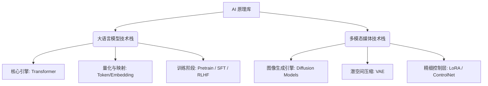
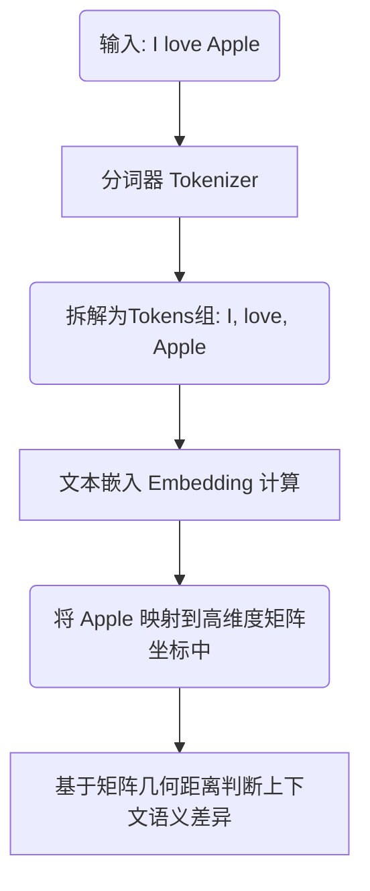

# AI深度认知:底层原理与生成模型全解析

> 万丈高楼平地起，本文系统梳理传统思维向AI Native转变所需掌握的核心运作原理，拨开大模型与生成式媒体的迷雾。

# 一、背景
从传统工程师视角来看，过去我们总是习惯于编写明确的逻辑分支（if-else）与规则。然而，在AI时代，基于规则的编程正迅速演进到基于概率和神经网络的模型输出。本文旨在跨越这种思维鸿沟，深度剖析大语言模型的推理过程，以及基于扩散原理的图片与视频生成机制，打通"知其所以然"的关键节点，为接下来研发具有智能属性的系统构筑基石。

# 二、整体架构
下图展示了AI基础组件中的两大主流分层架构方向：大语言模型（LLM）与生成式媒体（AIGC Media）。在这两个大分支上，各种底层架构作为地基支撑着不同的SaaS级能力。


以上架构呈现了不同方向生态模块之间的构成关系，整个AI的流转本质是数据映射到张量计算后再重新解码给人类呈现的过程。

# 三、核心模块详解：大语言模型原理
## 3.1 Transformer 引擎
Transformer 模型改变了过去的传统 RNN 递归序列分析法，其最核心的进化是**“自注意力机制(Self-Attention)”**。它在处理长文时不再逐字进行短时记忆读取，而是直接并行扫描并对每一个上下文字元建立相关性权重系数，寻找词汇之间最深刻的联结。

## 3.2 Tokens、Embeddings向量化
大段文本是怎么被AI计算的？下图展示了文本词汇的量化流程：


**关键节点：** 整个流转的枢纽在于 **Embedding（词嵌入矩阵）**，它强制把抽象的文字变成了可以加减乘除的高维空间坐标体系，语义相近的词在高维宇宙里的物理距离非常靠近。

> **🔍 Q&A 随堂思考：为什么AI做数学题经常翻车？**
> 时至今日你一定没忘咱俩聊过的话题：AI为何分不清 9.8 和 9.11 哪个大？
> 答：因为在分词（Token化）阶段，9.11 被切分成了 `[9, ., 11]`，而 9.8 是 `[9, ., 8]`。对 AI 而言，这就像完全不相关的两组 ID 标记。这就是机制决定了盲区，理解底层机制才能知道 AI 的能力边界在哪。

## 3.3 训练微调架构 (SFT / RLHF)
模型不能拿来即用，需要经历严格的三个核心周期：
1. **Pre-training (预训练)**：无脑填喂海量文本，目的是让其学会宇宙规律和接龙概率。
2. **SFT (监督微调)**：加入优质的“问题-答案”对引导训练，让其学会一问一答的交互礼仪。
3. **RLHF (人类反馈强化学习)**：人类针对其生成的多个版本答案打分排序，修正其恶意的、不准确的输出倾向。

# 四、核心模块详解：媒体生成与控制
## 4.1 Diffusion 扩散机制原理
生成式图像不等于拼积木，其骨干叫扩散（Diffusion）。我们可以把它理解为：算法接收了一张全是雪花点的电视机屏幕，通过算法进行几十步微小的去噪预测迭代，从白噪音中一点点把合理的像素“搓”出来的过程。

## 4.2 控制层：VAE与LoRA
*   **VAE (变分自编码器)**：负责在“人类像素尺寸”和极高压缩率的“潜在空间(Latent Space)”之间进行转换操作，计算都在潜空间中进行，释放了由于原图像素过大造成的显存压力。
*   **LoRA / ControlNet**：微调技术，就像在主模型大脑外挂插上一块优盘，使得基础模型能够不改变主体结构的前提下，完美学习新的特定画风、或者通过提取边缘线锁定画中人物的姿态特征。

# 五、实战用例
在我们日常做API交互开发工作时，控制输出结果不仅靠提示词，也靠底层参数调整。以下是真实的代码调用演示，同时为你还原咱们之前的**“私有数据架构决策盲测”**：

> **🎯 架构师水平大考：遇到团队诉求，如何选择技术方案？（Pre-train / SFT / RAG）**
> 
> *   **场景 1：如果你要让AI精准回答一本刚上线的私有员工手册。**
>     **正解：RAG (检索增强)。** 不用训练，做向量入库。成本极低，这就好比让大学毕业生开卷查书回答。
> *   **场景 2：如果你要求AI按照极其生僻的格式吐出特定的嵌套表单。**
>     **正解：SFT (监督微调)。** RAG用来补充知识，微调用来纠正行为！只喂行为数据即可。
> *   **场景 3：你发现一种前所未有的小语种，基座里连这个词根都不认识。**
>     **正解：Pre-training (重度预训练)。** 非常费钱，只适合从零灌输世界观。

**Python 端** - 模型推理参数控制示例
```python
import openai

# 请求对话生成：演示参数调整对原理底层的宏观影响
response = openai.ChatCompletion.create(
    model="gpt-4o",
    messages=[{"role": "user", "content": "用古汉语解释量子力学"}],
    # Temperature 决定模型预测概率分布：0 选取绝对最大值（保守），1 则概率拉平容忍度极高（发散）
    temperature=0.8, 
    # Top-P 控制尾部过滤机制，确保模型仅考虑头部有效范围的预测概率，避免生成错别字或无逻辑内容
    top_p=0.9,
    max_tokens=2048
)
```

# 六、总结
AI底层技术已经形成了标准化的架构沉淀，无论是NLP处理还是图像处理都有完善的技术流派体系。以下为常见术语及概念对照表：

| 术语名称 | 英文解析 | 认知含义建议 |
|---|---|---|
| Token | 分词碎片 | 大模型用来计费与吞吐判断的最小语义文字块。 |
| Embedding | 特征词嵌入向量 | 传统检索靠字面相等，此技术依赖数学向量空间位置寻找语义相近解。 |
| LoRA | 低秩适应微调 | 以极小代价在原本固定的大模型基础上学习新业务风格、新领域知识的点缀包。 |

**修改注意事项：**
* 请时刻牢记大模型是基于文本预测概率输出而非查询精确库表数据，当存在不确定领域强依赖计算时务必结合其他工具校验以防出现幻觉 (Hallucination)。
* 在多模态图像实战中，应灵活运用参数种子（Seed）记录复现效果，并且避免大尺寸图像直接训练，务必过一遍 VAE。
